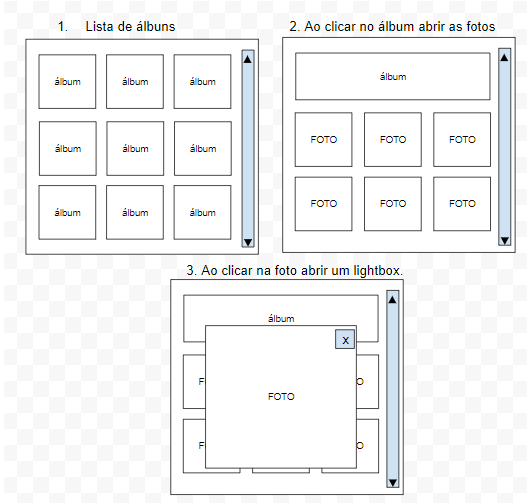

# Quer fazer parte da Superbid Webservices ?

O teste consiste basicamente em algumas perguntas abaixo e um teste pratico, basta fazer um fork do repositório responder as perguntas no próprio README.md e submeter o pull request.

## Questionário

* Você já teve alguma experiências em desenvolvimento componentes customizados? Como evitar o problema de componentes complexos com baixa performance?

-Não tive. Pesquisando sobre componentes com baixa performance, entendo que o prévio planejamento destes componentes customizados, bem como a boa divisão de responsabilidade, auxilia em grande parte do consumo desnecessário de memória, bom uso do poder que a ferramenta oferece.

* Quais patterns você já usou ou conhece para otimizar as chamadas a APIs Rest?

-Utilizei algumas por estudo: Content Negotiation(por ser padrão de onde estava consumindo); Authorization para acesso de determinada requisição somente comprovando a identidade através de token(JWT),
Conheço a teoria de:
Pagination - que reduz a quantidade de dados retornados, previnindo o consumo desnecessário de recursos do servidor.
Stateless - que aumenta o desempenho da requisição por evitar a retenção de informação/sessão durante várias requisições feitas pelo mesmo IP, por exemplo.

* Como lidar com cache (browser/cdn/proxy) no lançamento das novas versões da sua aplicação web?

-Nunca utilizei o cache, mas pesquisando, uma abordagem para a atualização do cache a cada nova versão, pode ser utilizado o AppCache do próprio HTML5 com seus arquivos de manifesto que se comunica diretamente com o browser.

* Na sua opinião, quais são as vantagens de React? quais são as desvantagens/riscos no uso do React?

-Vejo que as vantagens do React é a flexibilidade pra criação de interfaces des usuário; a velocidade de renderização através do Virtual DOM; reutilização de componentes; comunidade e mercado em contínua ascenção, e por fim, a leveza e simplicidade em relação aos "frameworks concorrentes" ao mercado, por exemplo: Angular
Acredito que alguns pontos negativos tratram-se de: altíssima contribuição e mudança do framework com base na comunidade(que também pode ser um ponto positivo), mas leva a sempre aprender algo recentemente lançado em pouco tempo após a última versão. Esse ponto também acaba acarretando na documentação, que não fica tão abrangente, principlamente por conta dos frameworks de apoio a ferramenta.
Vejo também que o principal risco que é encontrado utilizando o React, é a "bola de neve" que pode ser causada, devido a falta de organização do projeto. 

* Considerando uma tela em React contendo informações em tempo real, que deve ser atualizada sempre que ocorrer um determinada ação no servidor, qual arquitetura ou protocolo de comunicação você utilizaria?

-Uma abordagem para esse tipo de aplicação poderia ser feita através de WebSocket, pelo motivo de permitir uma conexão bidirecional entre cliente-servidor. Baseando nisso, poderia ser utilizado um protocolo de WebSocket como WS e WSS para conexões entre as extremidades.

* Você já implementou reat com suporte a i18n ? quais os pontos importantes a serem considerados?

## Teste Prático 

Considerando a arquitetura básica utilizando React + Redux, criar uma app contemplando as 3 telas:

Consumir a seguinte api:

https://jsonplaceholder.typicode.com/photos

